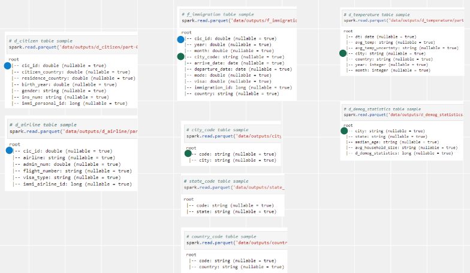

# Udacity Data Engineer Nanodegree - Capstone Project

### Project Summary
This project involves building a data warehouse with fact and dimension tables by integrating I94 immigration data, world temperature data and US demographic data.

The project follows the follow steps:

* Step 1: Scope the Project and Gather Data
* Step 2: Explore and Assess the Data
* Step 3: Define the Data Model
* Step 4: Run ETL to Model the Data
* Step 5: Complete Project Write Up

---

### Step 1: Scope the Project and Gather Data

#### Scope
This project will integrate I94 immigration data, world temperature data and US demographic data to setup a data warehouse with fact and dimension tables.

* Data Sets 
    1. [I94 Immigration Data](https://travel.trade.gov/research/reports/i94/historical/2016.html)
    2. [World Temperature Data](https://www.kaggle.com/berkeleyearth/climate-change-earth-surface-temperature-data)
    3. [U.S. City Demographic Data](https://public.opendatasoft.com/explore/dataset/us-cities-demographics/export/)

* Tools
    * AWS S3: data storage
    * Python for data processing
        * Pandas - exploratory data analysis on small data set
        * PySpark - data processing on large data set

#### Describe and Gather Data 

| Data Set | Format | Description |
| ---      | ---    | ---         |
|[I94 Immigration Data](https://travel.trade.gov/research/reports/i94/historical/2016.html)| SAS |This data comes from the US National Tourism and Trade Office and contains international visitor arrival statistics by world regions and select countries and other data points.|
|[World Temperature Data](https://www.kaggle.com/berkeleyearth/climate-change-earth-surface-temperature-data)| CSV | This dataset comes from Kaggle and contains monthly average temperature data for different countries.|
|[U.S. City Demographic Data](https://public.opendatasoft.com/explore/dataset/us-cities-demographics/export/)| CSV | This data comes from OpenSoft and shows demographics of all US cities and census-designated places with a population greater or equal to 65,000.|

---

### Step 2: Explore and Assess the Data

#### Explore the Data 

1. Use pandas for exploratory data analysis to get an overview on these data sets
2. Split data sets to dimensional tables and change column names for better understanding
3. Utilize PySpark on one of the SAS data sets to test ETL data pipeline logic

#### Cleaning Steps

1. Transform arrdate, depdate from SAS time format to pandad.datetime
2. Parse description file to get auxiliary dimension table - country_code, city_code, state_code, mode, visa
3. Tranform city, state to upper case to match city _code and state _code table

Please refer to [Capstone_Project.ipynb](./Capstone_Project.ipynb).

(This step was completed in Udacity workspace as pre-steps for building up and testing the ETL data pipeline. File paths should be modified if notebook is run locally.)

---

### Step 3: Define the Data Model

#### Conceptual Data Model
Since the purpose of this data lake is for BI app usage, we will model these data sets with star schema data modeling.

* Star Schema

	

#### Data Pipeline Build Up Steps

1. Assume all data sets are stored in S3 buckets
2. Follow by Step 2 – Cleaning step to clean up data sets
3. Transform immigration data to 1 fact table and 2 dimension tables, fact table will be partitioned by `state_code`
4. Parsing label description file to get auxiliary tables
5. Transform temperature data to dimension table
6. Split demography data to 2 dimension tables
7. Store these tables back to target S3 bucket

---

### Step 4: Run Pipelines to Model the Data 

Check [etl.py](./etl.py) to see code.

#### 4.1 Create the data model

Data processing and data model was created by Spark.

Check [Capstone_Project.ipynb](./Capstone_Project.ipynb).

#### 4.2 Data Quality Checks

Data quality checks includes

1. No empty table after running ETL data pipeline
2. Data schema of every dimensional table matches data model

Please refer to [Quality-checks.ipynb](./Quality-checks.ipynb).

#### 4.3 Data dictionary 

Please refer to [Capstone_Project.ipynb](./Capstone_Project.ipynb).

---

### Step 5: Complete Project Write Up

#### Tools and Technologies
1. AWS S3 for data storage
2. Pandas for sample data set exploratory data analysis
3. PySpark for large data set data processing to transform staging table to dimensional table

#### Data Update Frequency
1. Tables created from immigration and temperature data set should be updated on a monthly basis since the raw data set is built up monthly.
2. Tables created from demography data set could be updated on an annual basis since it's data collection takes time..
3. All tables should be updated in an append-only mode.

#### Future Design Considerations
1. The data was increased by 100x.
	
	If Spark with standalone server mode can not process 100x data set, we could consider to put data in [AWS EMR](https://aws.amazon.com/tw/emr/?nc2=h_ql_prod_an_emr&whats-new-cards.sort-by=item.additionalFields.postDateTime&whats-new-cards.sort-order=desc) which is a distributed data cluster for processing large data sets on cloud

2. The data populates a dashboard that must be updated on a daily basis by 7am every day.

	[Apache Airflow](https://airflow.apache.org) can be used to schedule and automate this data pipeline. There are other services similar to apache Airflow such as dagster and Luigi.

3. The database needed to be accessed by 100+ people.

	[AWS Redshift](https://aws.amazon.com/tw/redshift/?nc2=h_ql_prod_db_rs&whats-new-cards.sort-by=item.additionalFields.postDateTime&whats-new-cards.sort-order=desc) can handle this efficiently. If our provisioned nodes are not sufficient, we can scale our resources to cater to the increased workload.

---
